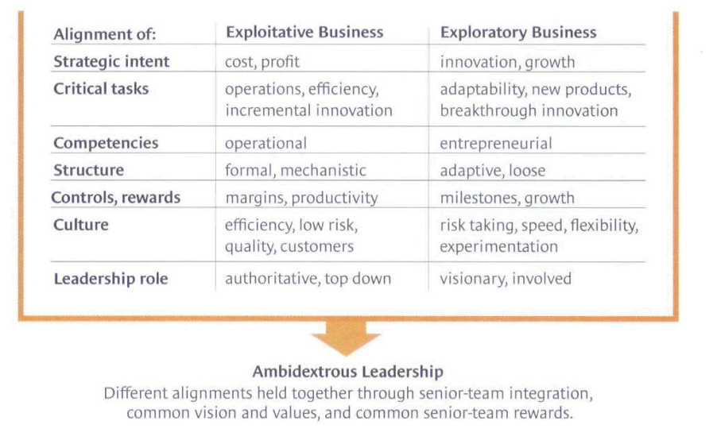

# Ambidextrous Organisation             
by Nadja Gottschalk and Lina Renner 

---

## Agenda 

1. Definition Ambidextrous Organisation 
2.  Innovation 
3. The concept of an ambidextrous organisation 
4. The importance of ambidexterity 
6. Influence on managers
7. Example 
8. Critics 
9. Discussion 

---

### Definition of an ambidextrous organisation 

ambo - both sides 
dexter - on the right side 
Ambidexterity = being as skilled with the left hand as with the right hand

---

#### Innovation 

Missed Innovation Strategy 
Employees are not motivated 
Innovation is spread only in one group 
Lack of collaboration 
Missed customer relations 

---

##### The concept of an ambidextrous organisation 

---

