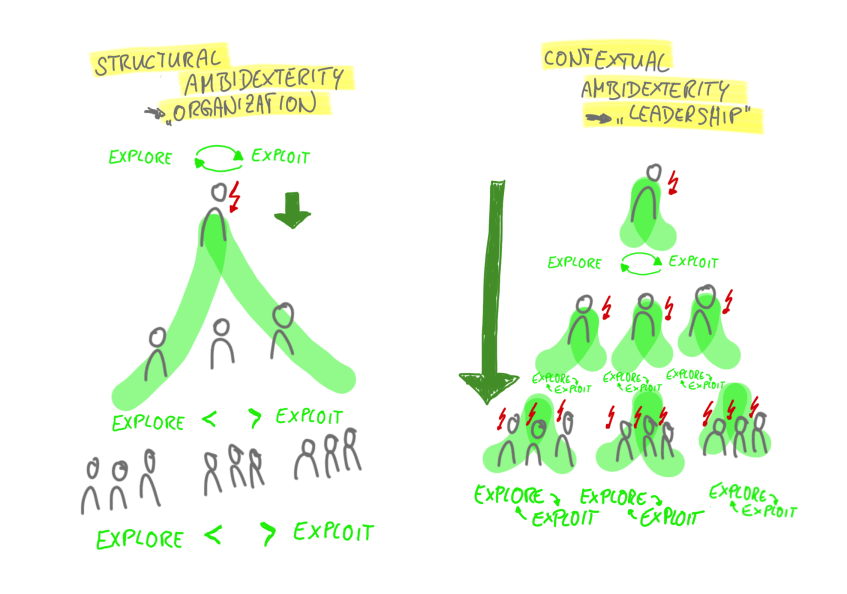

 

---

## What to expect:  

1. Definition Ambidexterity  
2. Innovation 
3. Concept of Ambidextrous Organisation  
4. Example 
5. Importance of Ambidexterity 
6. Critics 

---

### Definition of an ambidextrous organisation 

- ambo - both sides 
- dexter - on the right side 

Ambidexterity = being as skilled with the left hand as with the right hand

---

#### Ambidexterity in a business: 

- Manager deals with the growth of the business 
- Nowadays there are also new and disruptive innovations that have to be explored and managed 

The challenge is to manage both efficiently to be successful! 
 
---

#### Why can Innovation be a problem for companies? 

- Missed Innovation Strategy 
- Employees are not motivated 
- Innovation is spread only in one group 
- Lack of collaboration 
- Missed customer relations 

---

##### An Ambidextrous Organisation:

- Distinct units that have their own culture and structure 
- These units can be one or several innovation teams in a larger company but aim to support unique activities 
- Ambidextrous business models are used to drive innovation while keeping existing units 

---

Structure of an ambidextrous organisation 

---

Exploitation vs Exploration 

---

2 Forms of Organisational Ambidexterity: 

1. Contextual Ambidexterity 
2. Structural Ambidexterity 

---

---

Contextual Ambidexterity (part1): 
- Individuals make choices between either the exploitation-oriented or the exploration-oriented activities in their daily work
- Being flexible is necessary: 
  - To allow employees to use their own judgment 
  - They can divide their time between their adaptation-oriented and alignment-oriented activities 

---

Contextual Ambidexterity (part2): 

- Simultaneous pursuing of explorative and explorable measures within a single business unit 
  - Built on processes that encourage individuals to divide their time between activities 
  - They provide value to current customers and seek opportunities and respond to continuous change 

---

Structural Ambidexterity:
  
- Creation of separate organizations or structures for different types of activities
→ Organizations that are either solely aligned or solely adaptive
- Firm separates the explorative from the exploitative unit, each with different management, processes, structures, and cultures, but are well integrated under a senior management team 
  
---

Examples of ambidextrous organisations:

Go to www.menti.com and use the code: 70 20 64 

----

Results: 

https://www.mentimeter.com/s/3a4edba44f64d1cb8771d52509e66451

---

Example of 

---

Exploitation 📲                         
- App Store                            
- Customer Service                 
- Adaptation of products                
- Continous Improvement               

--- 

Exploration ⌚️
- Release of new products
- New competitive spaces 
- New areas to expand 
- New customers 

---

Importance of Ambidexterity 

- Business environments are getting more complex and diverse & therefore difficult to manage 
- Competitive landscape requires to cut costs and push efficiency 
- The environment is changing faster than ever before which requires innovative ideas 

Research: Ambidexterity leads to higher performance 

---

Critics 

- Lack of description of how managers can overcome the challenge of managing both 
- Original: it is about developing the necessary capabilities to compete in new markets and cope with technologies (ambidexterity as a capability)
- Nowadays: company should be able to manage both, innovation and efficiency 
- Reality: organisations face diverse competitive markets & they vary in the required rates of exploration and exploitation 

---

